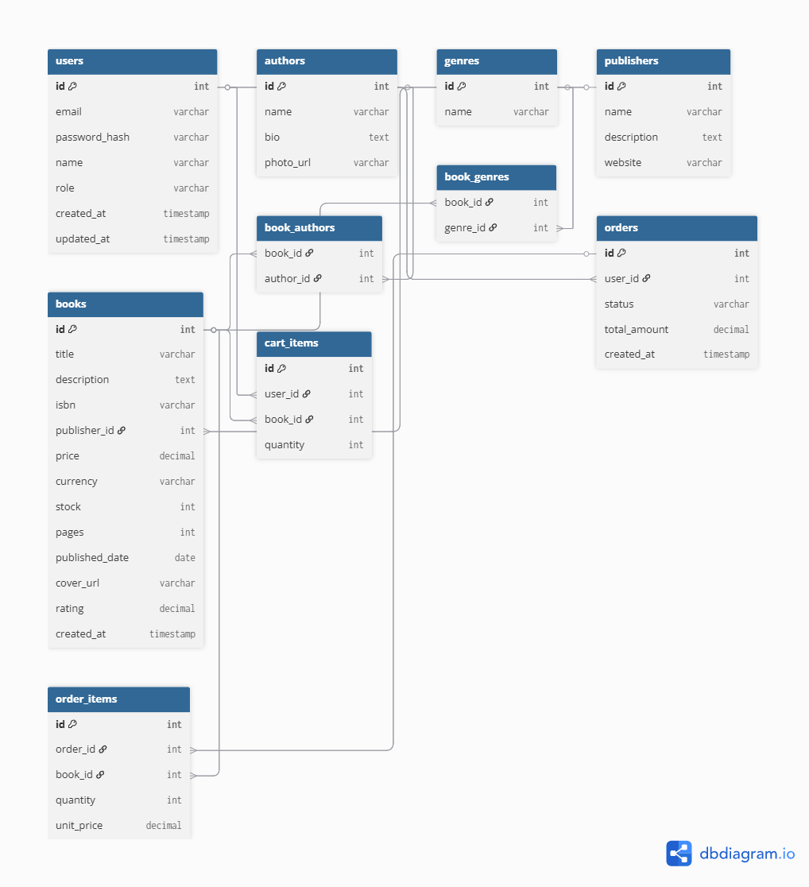

# Bookstore API

## Project name
Booky - online bookshop

## Features
- List all the books and search/filter them
- Browse authors, view all related books on each detail page
- View a book detail page with full data
- Admin users can create, edit, delete books/authors

## Base URL: `\`

### Users / Profile

#### `GET /users/me`
Get current user's profile
- **Responses**
  - `200 OK`
  ```json
  { "id": 12, "email":"user@example.com", "name":"Full Name", "role":"user" }
  ```

#### `PUT /users/me`
Update profile.
- **Request**
```json
{ "name": "New Name", "phone": "+380...", "address": "Kyiv, Ukraine" }
```
- **Responses**
  - `200 OK` updated profile

### Books

#### `GET /books`
List books with pagination, search and filters
- **Use**: Main listing page
- **Query parameters**
  - `q` — search query (title or author)
  - `authorId` — filter by author id
  - `publisherId` — filter by publisher id
  - `genre` — filter by genre name or id
  - `sort` — `price_asc`, `price_desc`, `popularity`
  - `page` — page number (default 1)
  - `limit` — items per page (default 20)
- **Responses**
  - `200 OK`
  ```json
  {
    "data": [
      {
        "id": 101,
        "title": "Example Book",
        "authors": [{"id":1,"name":"Author Name"}],
        "price": 249.99,
        "rating":4.5,
        "genres":["Fantasy","Adventure"]
      }
    ],
    "meta": { "page":1, "limit":20, "total": 345 }
  }
  ```

#### `POST /books`
Create a new book (admin only)
- **Request body**
```json
{
  "title": "New Book",
  "description": "Long description",
  "authors": [1,5], // id
  "genres": ["Fantasy","Kids"],
  "price": 199.50,
  "publishedDate": "2024-05-01",
  "pages": 320,
  "coverUrl": "https://..."
}
```
- **Responses**
  - `201 Created` `{ "id": 201, "title":"New Book", ... }`
  - `403 Forbidden` (non-admin)

#### `GET /books/{id}`
Get full book details
- **Use**: Book detail page
- **Path params**: `id` (book id)
- **Responses**
  - `200 OK`
  - `404 Not Found`

#### `PUT /books/{id}`
Update book (admin)
- **Request body**: partial or full book object
- **Responses** `200 OK` or `404` or `403`

#### `DELETE /books/{id}`
Delete book (admin)
- **Responses** `204 No Content` or `403` or `404`

---
### Authors

#### `GET /authors`
List authors (paginated)
- **Query**: `q` (search)
- **200 OK**: list of authors with `id`, `name`, `bio`, `photoUrl`, `bookCount`

#### `POST /authors`
Create author (admin)
Similar to the books

#### `GET /authors/{id}`
Get author detail including list of their books.
- **200 OK**
```json
{
  "id": 5,
  "name": "Author Name",
  "bio": "...",
  "photoUrl":"https://...",
  "books": [{ "id":101,"title":"...","price":199.5, "thumbnail":"..."}]
}
```

#### `DELETE /authors/{id}` (admin)
Similar to the books 

### Cart

#### `GET /api/v1/cart`
Get current user's cart.
- **Response**
```json
{ "items": [{ "bookId":101, "title":"...", "price":199.5, "quantity":2 }], "total": 399.0 }
```

#### `POST /cart`
Add item to cart / update quantity
- **Request**
```json
{ "bookId": 101, "quantity": 1 }
```
- **Responses**
  - `200 OK` updated cart

#### `DELETE /cart/{bookId}`
Remove item from cart

#### `POST /cart/checkout`
Create an order from the cart 
- **Response**
  - `201 Created` 
  - `400 Bad request` (if cart is empty)
  ```json
  { "orderId": 501, "status": "created", "total": 399.0, "items": [...] }
  ```
---

### Orders

#### `GET /orders`
Get current user's orders
#### `GET /orders/{id}`
Get specific order

---

## Database schema

Entities:
- users (id, email, password_hash, name, role, created_at, updated_at)
- authors (id, name, bio, photo_url)
- genres (id, name)
- books (id, title, description, isbn, publisher_id, price, currency, stock, pages, published_date, cover_url, rating, created_at)
- book_authors (book_id, author_id)
- book_genres (book_id, genre_id)
- orders (id, user_id, status, total_amount, created_at)
- order_items (id, order_id, book_id, quantity, unit_price)
- cart_items (id, user_id, book_id, quantity)

